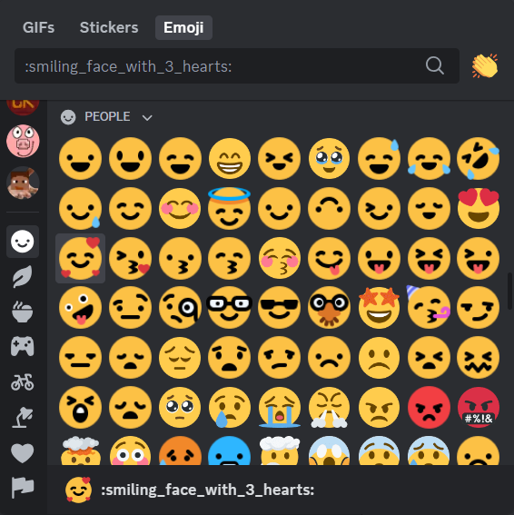
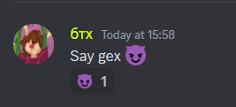
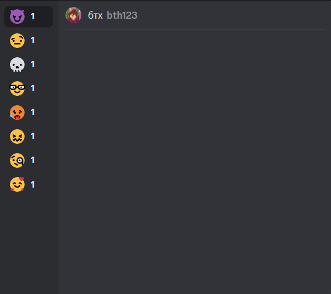
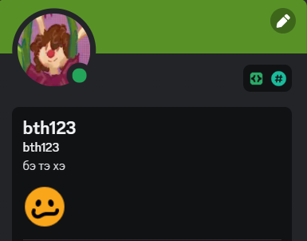

is theme for vencord and betterdiscord that changes default discord's emojis to new ones from message bar
#
# Showcase

# Instllation
1. Download `new-ds-emojis.theme.css` from [latest release](https://github.com/bth123/new-ds-emojis/releases/tag/theme)
2. Drag and drop the file to your client's `Themes` tab
3. Enable the theme
4. Enjoy!
